# YCA_VG_AlexeyAB_darknet

# Dependencies

Its better to have same versions explained below:

Opencv 3.2  
Cudnn 7.6.5  
Cuda 10.2  

This a repo forked from VG_AlexeyAB_darknet(https://github.com/vincentgong7/VG_AlexeyAB_darknet) which is forked from AlexeyAB_darknet(https://github.com/AlexeyAB/darknet) with more features on YOLO batch/test detector. You can download and build the solution after arranging below paths in Visual Studio or do the equivalent steps if you will use another system.

Linker -> General -> Additional Library Dependencies  
Linker -> Input -> Additional Dependincies  
C/C++ -> General -> Additional Include Directories  

General placements and system environment definitions are shown below:

    

To build darknet.sln look at Figure1 and to build darknet_no_gpu look at Figure2

 <b><i> Figure 1 </b></i>      

  <b><i> Figure 2 </b></i>       

<b>! Dont forget to add .dll files next to the darknet.exe / darknet_no_gpu.exe file after build </b>   
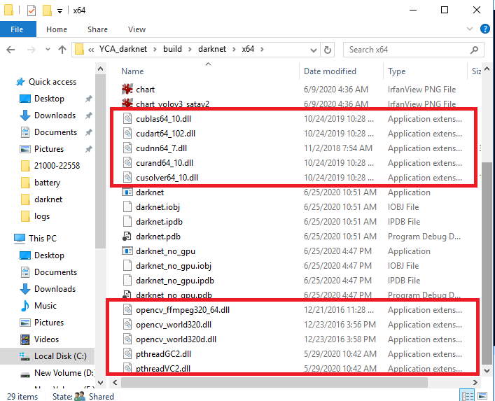      

I use VS2019 and opencv_3.2 for this code. You can download opencv version from  https://opencv.org/opencv-3-2/  

This repo contains only the solution and dataset I already used and tested. (darknet.sln for train and darknet_no_gpu.sln for test)
So If you want to use another solution you can easily take it from the base repo I mentioned above.  

# General Usage

To train your custom dataset, use one of these commands after replacing "SATA" folder, "obj.data" file, "yolov3_sata.cfg" file with your custom dataset and files and add pretrained weights(https://pjreddie.com/media/files/darknet53.conv.74   https://drive.google.com/file/d/18v36esoXCh-PsOKwyP2GWrpYDptDY8Zf/view?usp=sharing) to the related folder. 

<i> darknet.exe  detector train data/SATA/obj.data cfg/yolov3_sata.cfg weights/pretrained/darknet53.conv.74 (to train with yolov3 using pretrained weights) </i>

<i> darknet.exe  detector train data/SATA/obj.data cfg/yolov3_sata.cfg weights/pretrained/yolov3-tiny.conv.11 (to train with tiny yolov3 using pretrained weights) </i>

To test your model with a single image use this command after replacing "SATA" folder, "obj.data" file, "image.png" file and sata.weights(use your weights trained with the training command!)

<i> darknet_no_gpu.exe detector test data/SATA/obj.data cfg/yolov3_sata.cfg weights/sata.weights -filename data/SATA/image.png </i>

To test your model with a batch of test image use this command after replacing "SATA" folder, "obj.data" file, "image.png" file and sata.weights(use your weights trained with the training command!)

<i> darknet_no_gpu.exe detector batch data/SATA/obj.data cfg/yolov3-tiny_sata.cfg weights/yolov3-tiny_sata.weights -in_folder data/SATA/in_images/ -out_folder data/SATA/out_images/ -out results/result.txt </i>

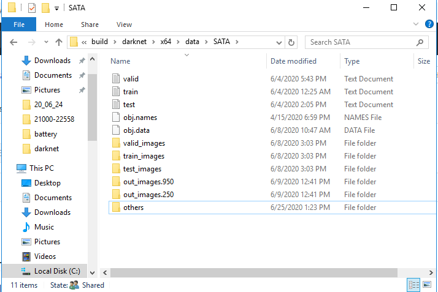  <b><i> Inside view of a sample "SATA"(the folder contains your dataset, obj.data obj.name files and output folders) folder. </b></i>       

# Added features

## 1)Multiple Threshold

With this feature, you can make predictions with multiple prediction thresholds at the same time. The performance is x times faster when you use x different threshold. (e.g The prediction duration with 3 threshold with multi threshold feautres is 1.33468e+06 msec and the sum of 3 different threshold one by one is 1.06509e+06 msec x 3. using 500 coco input images)

When you use multi threshold feauture, you obtain different result.txt files and output image folders for each threshold value. You need to give the base folder and file name during running the code via terminal. Not all the folder and file names separately. (e.g When you type out_folder data/COCO/out_images/ the app creates different output image folders via the given threshold values like data/COCO/out_images.25/ data/COCO/out_images.90/ when the given threshold values are 0.25 and 0.90. Likewise when you type -out results/result.txt the app creates different output files via the given threshold values like results/result.25 results/result.90 when the given threshold values are 0.25 and 0.90)

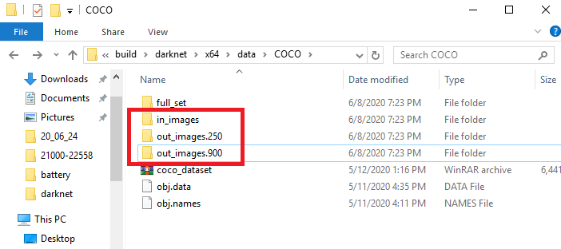 <b><i> outputs created in data/COCO folder </b></i>      

 

Figure : Different results of prediction with threshold values 0.25 & 0.90

 

Figure : Different results of prediction with threshold values 0.25 & 0.90

In summary, we can say that more detailed objects are detected with the 0.25 threshold. As for 0.90 threshold, the accuracy rate will be higher since the prediction will only detect objects having high probability. You can use the multi-threshold feature for making comparisons with different values and to choose best prediction threshold for your model.

You can use this feature with the below command:
 
<i> darknet_no_gpu.exe detector batch data/COCO/obj.data cfg/yolov3_coco.cfg weights/yolov3_coco.weights -in_folder data/COCO/in_images/ -out_folder data/COCO/out_images/ -out results/result.txt -multi_thresh 3 0.90 0.50 0.25 </i>

## 2) Log Files

I updated the code so it creates a train_log file who includes some information about training process like iteration number, avg loss, etc. You can see the train_log at the same location with .exe file without doing anything.  

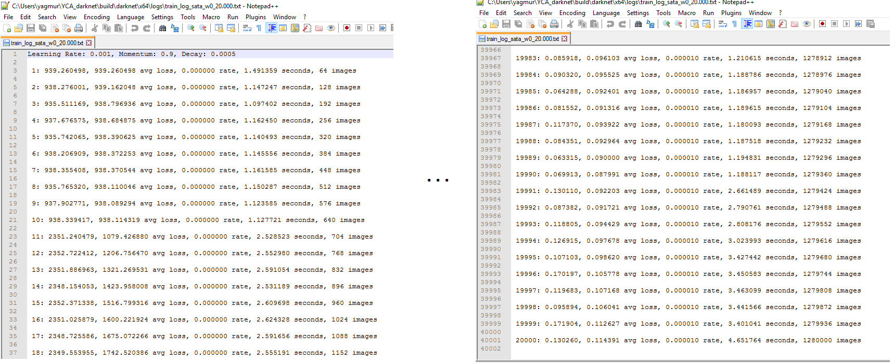   

I updated the code so it creates a valid_log file who includes some information about performance of the model like class aP's, mAP, detection time etc. You can use the command below and compare different weights saved at different stages during training.   

<i> darknet.exe detector map data/SATA/obj.data cfg/yolov3_satav2.cfg backup/yolov3_satav2_8000.weights  </i>  
<i> darknet.exe detector map data/SATA/obj.data cfg/yolov3_satav2.cfg backup/yolov3_satav2_10000.weights </i>  
<i> darknet.exe detector map data/SATA/obj.data cfg/yolov3_satav2.cfg backup/yolov3_satav2_15000.weights </i>    

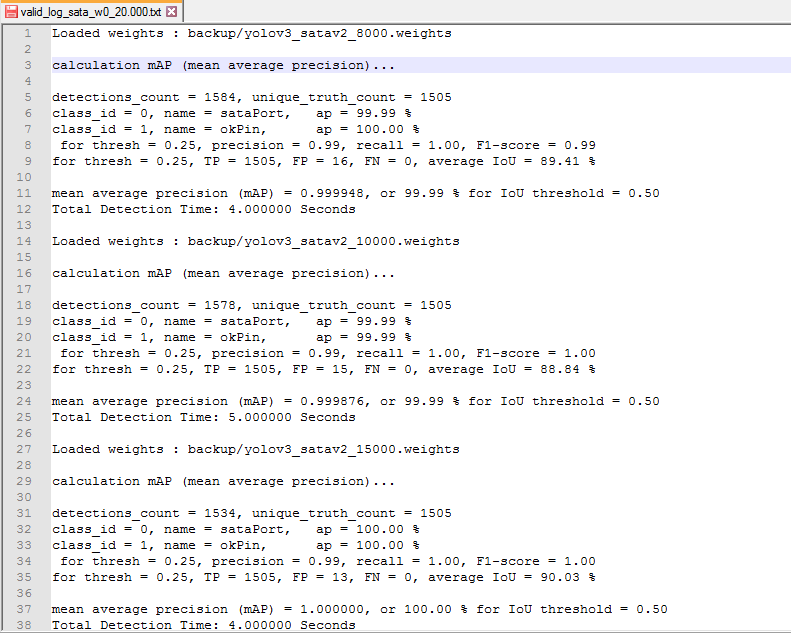

## 3) Drawing Labels With Prediction Probabilities

I updated the code as to write the probability with the label next to the bounding box. 
Left image shows the older and right image shows the newer version of the output image. 

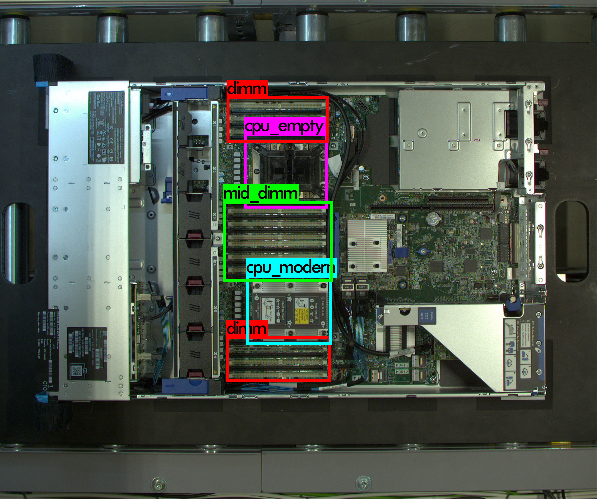   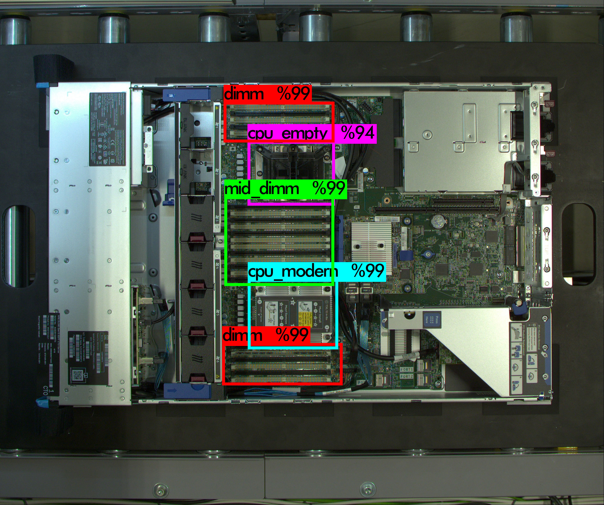 

## 4) Saving Prediction Boxes via Grouping by class names

I updated the code as to save detections as new images to the output folders named by class names. So you can have new datasets after using your test images   
You need to specify the output folder for cutted images by using -cut_folder path 

A prediction and cut-detections example for my trained model with 5 different classes. 
darknet_no_gpu.exe detector batch data/overview/obj.data data/overview/Model1/overview_v6.cfg data/overview/Model1/overview_v6.weights -in_folder data/overview/test_images/ -out_folder data/overview/output/ -cut_folder data/overview/cutted/ 

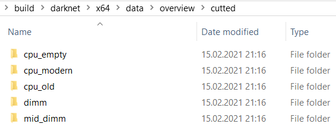  
Automatically created output folders according to my class names  
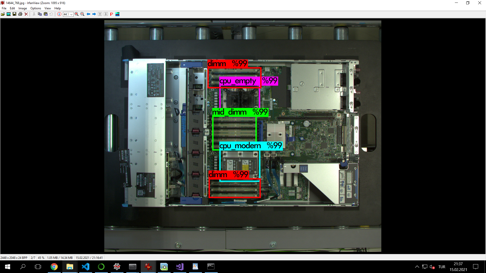   
Detection results of an image (saved on data/overview/output)  

Cutted and saved detections of that predicted image :

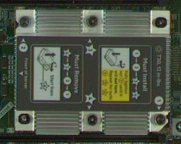  
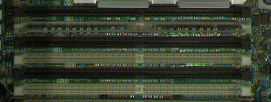  
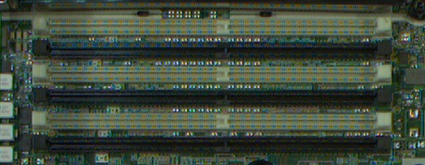    
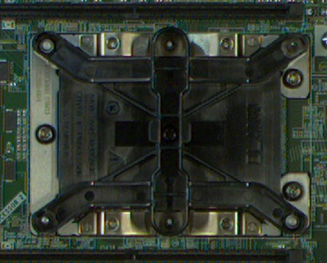  
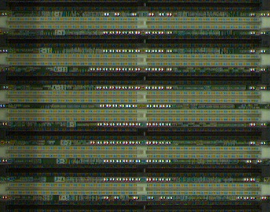  

<b> !!! </b>  Even if you have more than one detection box for the same class, they are saved with different names so any bounding box is overwrited.

<b> !!! </b> If you want to have different folders for prediction and cut (E.g you can have a test images folder which have same images for cutting edges, but resized ones to have predictions faster and cutted images better as resized-small images). You can use -raw folder path feature to declare that you give raw -unresized images to cut the detections, but the prediction will be done with in_folder anyway

## Important Notes

When typing multi threshold values, make sure to give the values in decreasing order.      
You can use the command without -out or -out_folder if you dont want to obtain these outputs.      
If you dont want to use multi threshold feauture but to determine one threshold value use -thresh xx command.     
To be able to benefit these features, dont remove OPENCV definition on Properties->Preprocessor window !

# Command descriptions of other features from base repos

Use "-save_labels" for saving labels as yolo annotation files  

