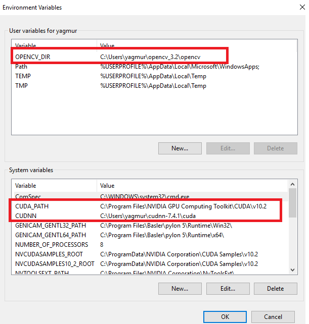

# YCA_VG_AlexeyAB_darknet

This a repo forked from VG_AlexeyAB_darknet(https://github.com/vincentgong7/VG_AlexeyAB_darknet) which is forked from AlexeyAB_darknet(https://github.com/AlexeyAB/darknet) with more features on YOLO batch/test detector. You can download and build the solution after arranging below paths in Visual Studio or do the equivalent steps if you will use another system.

Linker -> General -> Additional Library Dependencies  
Linker -> Input -> Additional Dependincies  
C/C++ -> General -> Additional Include Directories  

General placements and system environment definitions are shown below:

 

To build darknet.sln look at Figure1 and to build darknet_no_gpu look at Figure2

 Figure 1     

  Figure 2     

I use VS2019 and opencv_3.2 for this code. You can download opencv version from  https://opencv.org/opencv-3-2/  

This repo contains only the solution and dataset I already used and tested. (darknet.sln for train and darknet_no_gpu.sln for test)
So If you want to use another solution you can easily take it from the base repo I mentioned above.   

# Added features

## 1)Multiple Threshold

With this feature, you can make predictions with multiple prediction thresholds at the same time. The performance is x times faster when you use x different threshold. (e.g The prediction duration with 3 threshold with multi threshold feautres is 1.33468e+06 msec and the sum of 3 different threshold one by one is 1.06509e+06 msec x 3. using 500 coco input images)

When you use multi threshold feauture, you obtain different result.txt files and output image folders for each threshold value. You need to give the base folder and file name during running the code via terminal. Not all the folder and file names separately. (e.g When you type out_folder data/COCO/out_images/ the app creates different output image folders via the given threshold values like data/COCO/out_images.25/ data/COCO/out_images.90/ when the given threshold values are 0.25 and 0.90. Likewise when you type -out results/result.txt the app creates different output files via the given threshold values like results/result.25 results/result.90 when the given threshold values are 0.25 and 0.90)

 

Figure : Different results of prediction with threshold values 0.25 & 0.90

 

Figure : Different results of prediction with threshold values 0.25 & 0.90

In summary, we can say that more detailed objects are detected with the 0.25 threshold. As for 0.90 threshold, the accuracy rate will be higher since the prediction will only detect objects having high probability. You can use the multi-threshold feature for making comparisons with different values and to choose best prediction threshold for your model.

## Usage

darknet_no_gpu.exe detector batch data/COCO/obj.data cfg/yolov3_coco.cfg weights/yolov3_coco.weights -in_folder data/COCO/in_images/ -out_folder data/COCO/out_images/ -out results/result.txt -multi_thresh 3 0.90 0.50 0.25  

## Important Notes

When typing multi threshold values, make sure to give the values in decreasing order.  
You can use the command without -out or -out_folder if you dont want to obtain these outputs.  
If you dont want to use multi threshold feauture but to determine one threshold value use -thresh xx command.  

# Command descriptions of other features from base repos

Use "detection test" for single image detection
Use "detection batch" for multiple image detection. For that you should use "-in_folder imagepath" too.
Use "-save_labels" for saving labels as yolo annotation files

